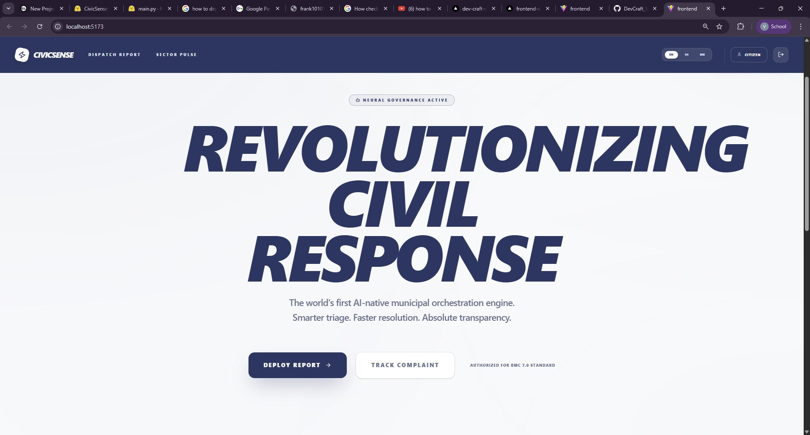
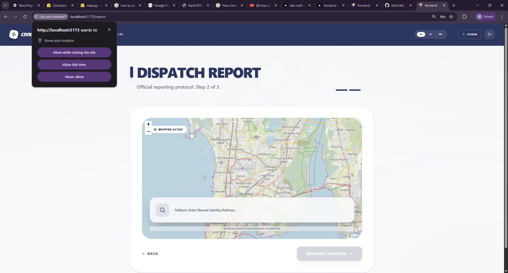
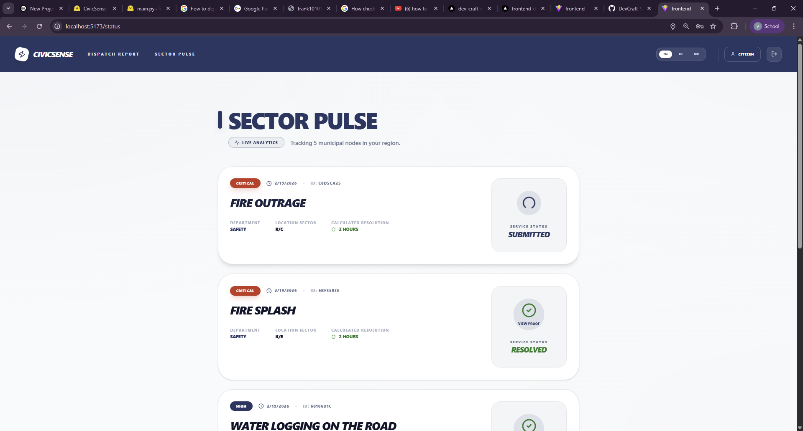
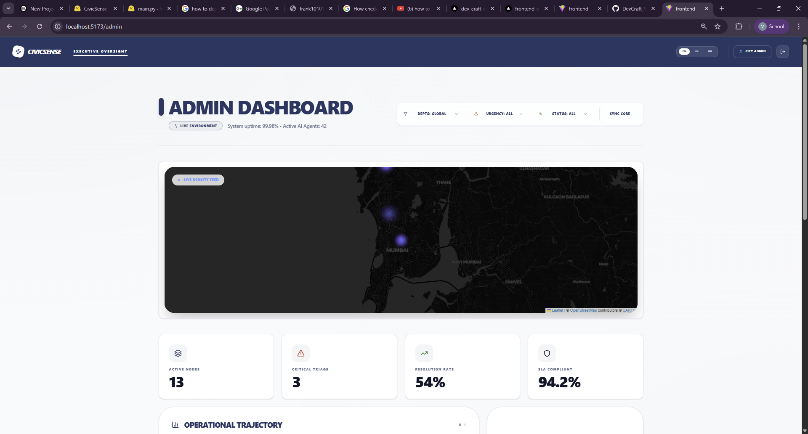
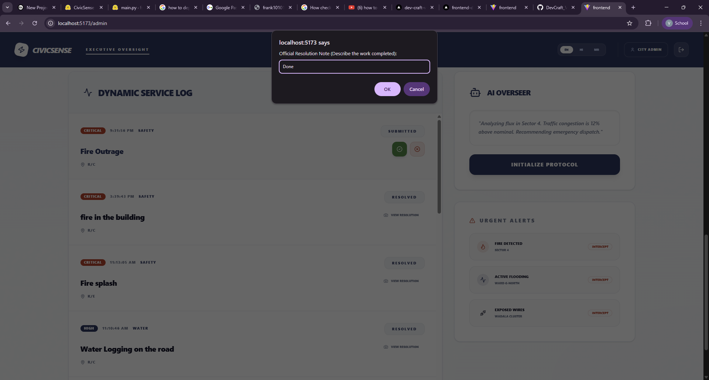

# 🏛️ CivicSense — AI-Driven Municipal Complaint System

An intelligent civic platform that uses **NLP, Computer Vision, and Geospatial Analytics** to automatically classify, prioritize, and route citizen complaints — modeled after **Mumbai's BMC Ward system**.

---

## 🔗 Live Deployment (Production)

> [!IMPORTANT]
> The backend is hosted on **Hugging Face Spaces** (16GB RAM) to handle large AI models, while the frontend is on **Vercel**.

*   **🌍 Live Portal:** [Visit CivicSense](https://frontend-dc-eta.vercel.app/) 
*   **⚙️ Backend API:** `https://frank10101-civicsense.hf.space`
*   **🚦 API Health:** [Check Status](https://frank10101-civicsense.hf.space/health)

---

## 📌 Project Overview

Citizens submit complaints via text, voice, or image. Our AI Neural Suite instantly orchestrates the following:

1.  **Categorization:** Automatically identifies the department (Roads, Waste, Water, etc.) using `BART-MNLI`.
2.  **Urgency Scoring:** Assigns priority (Critical, High, Medium, Low) using `DistilBERT` sentiment & keyword analysis.
3.  **Visual Triage:** Detects civic issues in photos (e.g., potholes, garbage) using `YOLOv8`.
4.  **Voice Recognition:** Transcribes audio complaints via `OpenAI Whisper`.
5.  **Duplicate Detection:** Prevents multiple reports for the same incident using `MiniLM-L6-v2` semantic embeddings.
6.  **Geospatial Intelligence:** Maps locations to Mumbai's BMC Wards using point-in-polygon geometry.

---

## 🛠️ System Architecture

| Layer | Technology |
| :--- | :--- |
| **Frontend** | React 19 + TypeScript + Vite + Tailwind CSS |
| **Backend** | FastAPI (Python 3.10) |
| **Database** | Supabase (PostgreSQL + pgvector) |
| **AI/ML** | HuggingFace, YOLOv8, Whisper, SentenceTransformers |
| **Real-time** | WebSockets (Dashboard Live Feed) |
| **Deployment** | Docker (Backend) + Vercel (Frontend) |

---

## 📖 Essential User Guide

### 🔑 Demo Credentials

| Role | Email | Password |
| :--- | :--- | :--- |
| **Citizen** | `citizen@example.com` | `password123` |
| **City Admin** | `admin@city.gov` | `adminpassword` |
| **Roads Officer** | `roads@city.gov` | `password123` |

---

### 🚶 The "Quick-Start" Flow

#### 1. Reporting an Issue (Citizen)
1.  **Login** as a Citizen.
2.  Click **"Report Issue"** from the home command center.
3.  **Describe** the issue (Type it or click the Mic to speak).
4.  **Location**: Click the map to pin the exact spot.
5.  **Attachments**: Upload a photo for AI visual verification.
6.  **Submit**: Watch the AI analyze and route it in < 2 seconds.

#### 2. Managing the City (Officer/Admin)
1.  **Login** as an Official.
2.  View the **Live Triage Map** to see hotspots across Mumbai.
3.  Open a complaint to see AI insights (Urgency, Category, Visual Tags).
4.  **Resolve**: Click "Resolution Proof" -> Enter your work note -> Status becomes **Resolved**.

#### 3. Verifying Results (Citizen)
1.  Go to **"Track Status"**.
2.  Click **"View Resolution Proof"** to see what the officer documented.

---

## 📸 Visual Walkthrough

### 1. Citizen Experience

*Figure 1: High-fidelity municipal landing page with role-aware portals.*


*Figure 2: AI-driven reporting flow with geospatial map integration.*


*Figure 3: Personal tracking hub with real-time AI triage status.*

### 2. Administrator Executive Suite

*Figure 4: Executive Command Center with Live Heatmap and Triage Feed.*


*Figure 5: Verifiable resolution proof system for municipal transparency.*

---

## ⚙️ Local Development Setup

### 1. Backend
```bash
cd backend
pip install -r requirements.txt
# Set .env with SUPABASE_URL, SUPABASE_KEY, JWT_SECRET
uvicorn main:app --reload
```

### 2. Frontend
```bash
cd frontend
npm install
# Set VITE_API_URL in .env
npm run dev
```

---

## 👥 Team — DevCraft
*Built with ❤️ for Mumbai's Digital Transformation.*
